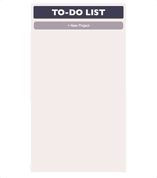

# JavaScript To-do List

[![Contributors][contributors-shield]][contributors-url]
[![Forks][forks-shield]][forks-url]
[![Stargazers][stars-shield]][stars-url]
[![Issues][issues-shield]][issues-url]

## About the project

This project is designed to be used as a mobile app.
It implements a to-do list. It's built entirely on JavaScript, HTML and CSS.

## Features

Some of the features of this project include:

- Create new projects
- Create new tasks inside those projects
- Setting priority
- Setting status (completed/not completed)

## Live Link

To preview the project check this link:

[Live Project](https://rawcdn.githack.com/JayKowski/to-do-list/f83525b1521fb173039d1163a85077025b1b42cc/index.html)

## Technologies Used

This project utilizes:

- JavaScript
- CSS
- HTML

<!-- 

## Testing

## Test Output

-->

## Contributors

- Alvaro Paz
  - Linkedin: [@alvaropaz](https://linkedin.com/in/alvaropaz/)
  - GitHub: [@alvaropazz](https://github.com/alvaropazz)
  - Twitter: [@alvaroipazr](https://twitter.com/alvaroipazr)

- Jay Maina
  - LinkedIn : [Jay Maina](https://www.linkedin.com/in/jay-maina)
  - GitHub: [@JayKowski](https://github.com/JayKowski)
  - Twitter: [@Kowskijayy](https://twitter.com/Kowskijayy)
  
<!-- MARKDOWN LINKS & IMAGES -->

[contributors-shield]: https://img.shields.io/github/contributors/JayKowski/to-do-list.svg?style=flat-square
[contributors-url]: https://github.com/JayKowski/to-do-list/graphs/contributors
[forks-shield]: https://img.shields.io/github/forks/JayKowski/to-do-list.svg?style=flat-square
[forks-url]: https://github.com/JayKowski/to-do-list/network/members
[stars-shield]: https://img.shields.io/github/stars/JayKowski/to-do-list.svg?style=flat-square
[stars-url]: https://github.com/JayKowski/to-do-list/stargazers
[issues-shield]: https://img.shields.io/github/issues/JayKowski/to-do-list.svg?style=flat-square
[issues-url]: https://github.com/JayKowski/to-do-list/issues
